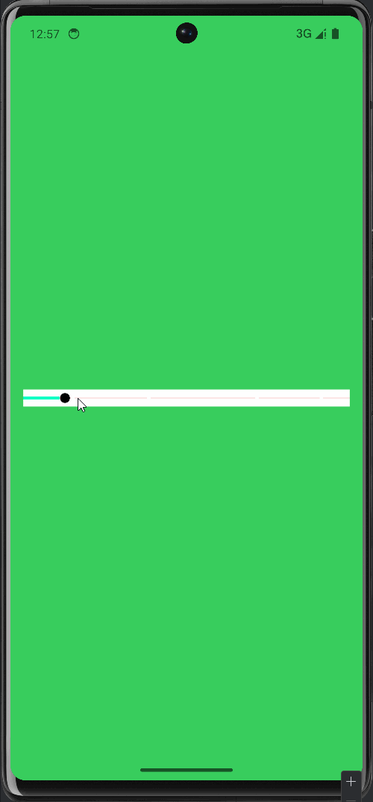

## Jetpack Compose 版段落进度条

<p> 一个Compose版段落进度条模仿BiliBili UI实现</p>

## 用途

- 实现视频播放章节模块段落进度分割查看

## 用法

引入ParagraphProgress

```kotlin
ParagraphProgress(
    modifier = Modifier
    value = progress,
    paragraphPoints = List<Float>,
    onValueChange = {}
)
```

添加进度和段落点

```kotlin
var progress by remember { mutableFloatStateOf(0f) }
val paragraphPoints = listOf(0.151564f, 0.384686f, 0.7165465f, 0.9135143f)
ParagraphProgress(
    modifier = Modifier
    value = progress,
    paragraphPoints = paragraphPoints,
    onValueChange = {}
)
```

进度回调

```kotlin
var progress by remember { mutableFloatStateOf(0f) }
val paragraphPoints = listOf(0.151564f, 0.384686f, 0.7165465f, 0.9135143f)
ParagraphProgress(
    modifier = Modifier
    value = progress,
    paragraphPoints = paragraphPoints,
    onValueChange = { newProgress ->
        progress = newProgress
    }
)
```


## 🖥️ 效果图





